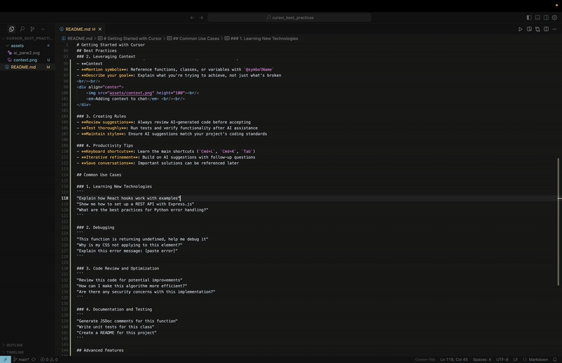

# Getting Started with Cursor

Cursor is an AI-powered code editor built on top of VS Code, designed to enhance your coding experience with intelligent assistance. This guide will help you get up and running quickly.

## Table of Contents

- [Installation](#installation)
- [Essential Keyboard Shortcuts](#essential-keyboard-shortcuts)
- [Key Features](#key-features)
- [Configuration and Settings](#configuration-and-settings)
- [Getting Started Workflow](#getting-started-workflow)
- [Common Use Cases and Examples](#common-use-cases-and-examples)
- [Best Practices](#best-practices)
- [Advanced Features](#advanced-features)
- [Common Issues and Solutions](#common-issues-and-solutions)
- [Learning Resources](#learning-resources)

## Installation

1. **Download Cursor**: Visit [cursor.com](https://cursor.com) and download the appropriate version for your operating system.
2. **Install**: Follow the standard installation process for your platform
3. **Sign up**: Create an account to access AI features and sync your settings

## Essential Keyboard Shortcuts

### Core AI Features
- **Chat**: `Cmd+L` (Mac) / `Ctrl+L` (Windows/Linux)
- **Inline Edit**: `Cmd+K` (Mac) / `Ctrl+K` (Windows/Linux)

### Tab Completion
- **Accept suggestion**: `Tab`
- **Reject suggestion**: `Esc`
- **Partial accept**: `Cmd+→` (Mac) / `Ctrl+→` (Windows/Linux)

### Inline Editing Controls
- **Apply changes**: `Cmd+Enter` (Mac) / `Ctrl+Enter` (Windows/Linux)
- **Cancel/Delete changes**: `Cmd+Backspace` (Mac) / `Ctrl+Backspace` (Windows/Linux)

### General Shortcuts
- **Command Palette**: `Cmd+Shift+P` (Mac) / `Ctrl+Shift+P` (Windows/Linux)
- **Settings**: `Cmd+,` (Mac) / `Ctrl+,` (Windows/Linux)
- **Toggle Sidebar**: `Cmd+B` (Mac) / `Ctrl+B` (Windows/Linux)
- **Toggle Terminal**: `Cmd+`` ` `` (Mac) / `Ctrl+`` ` `` (Windows/Linux)

## Key Features

### 1. AI Chat Assistant
- **Access**: Use `Cmd+L` (Mac) or `Ctrl+L` (Windows/Linux) to open the chat panel or click the Toggle AI Pane in top right corner. <br/><br/>
<div align="center">
    <br/>
    <em>Location of chat panel</em> <br/><br/>
</div>

- **Ask questions**: Get help with code explanations, debugging, and implementation suggestions
- **Context-aware**: The AI understands your current codebase and can provide relevant assistance
    - Enable Codebase Indexing in settings to give AI the full context of the project

### 2. Code Generation with Tab
- **Inline suggestions**: Start typing and press `Tab` to accept AI-generated code completions
- **Smart completions**: The AI suggests context-appropriate code based on your project
- **Multi-line generation**: Generate entire functions, classes, or code blocks

### 3. Agent Mode
- **Access**: Use `Cmd+L` (Mac) or `Ctr+L` (Windows/Linux) to open chat and switch to Agent mode in bottom left of chat window.
- **Create with natural language**: Prompt what to create or changes to make in natural language and Agent will execute changes.
- **File-wide changes**: Make complex modifcations across multiple files simultaneously using Agent mode.

### 4. Inline Edits
- **Access**: Use `Cmd+K` (Mac) or `Ctrl+K` (Windows/Linux) to open inline editor.
- **Modify with natural language**: Select chunk of code or edit with natrual language. Describe changes and AI will execute.

### 5. Codebase Understanding
- **@Symbols**: Method to referencing code, files, documentation using the `@` symbol
    - Can reference:
    - `@Files & folders` - Add specific files and folders to context
    - `@Code` -  Add certain lines of code to context
    - `@Docs` - Add documentation from outside sources into context
    - `@Git` - Add Git history, recent commits, etc. into context
    - `@Past Chats` - Add past Cursor chats into context
    - `@Cursor Rules` - Add rules into context
    - `@Terminal` - Add terminal outputs into context
    - `@Web` - Add web searches into context
- **Context inclusion**: The AI can analyze your entire codebase for better suggestions
- **Documentation generation**: Ask the AI to create documentation for your code
- See for [Common Use Cases and Examples](#common-use-cases-and-examples) to see how to leverage context

## Configuration and Settings

### Essential Settings to Configure
1. **Enable Codebase Indexing**: Settings → Features → Enable for full project context
2. **Model Selection**: Choose between different AI models based on your needs and subscription
3. **Auto-save**: Configure auto-save preferences for seamless workflow
4. **Privacy Settings**: Configure what data is sent to AI models
5. **Tab Completion**: Adjust AI suggestion frequency and behavior

### Custom Keybindings
- Access via `Cmd+Shift+P` → "Preferences: Open Keyboard Shortcuts"
- Customize AI feature shortcuts to match your workflow
- Create custom shortcuts for frequently used AI commands

### Workspace Settings
- Configure per-project AI behavior
- Set project-specific rules and preferences
- Manage context inclusion/exclusion per workspace

## Getting Started Workflow

### 1. First Time Setup
#### Install cursor command
 - Open command palette `Cmd+Shift+P` (Mac) or `Ctrl+Shift+P` (Windows/Linux) and search for `Install 'cursor' command`
```bash
# Open your project in Cursor
cursor /path/to/your/project

# Or create a new project
mkdir my-new-project
cd my-new-project
cursor .
```
- If you have VS Code settings you would like to import, click the gear cog icon in the top right and under the `General` tab should be a button to import settings from VS Code

### 2. Basic Usage Examples

#### Ask for Help
- Open chat (`Cmd+L` for Mac or `Ctrl+L` for Windows/Linux) and ask questions like: "How does this function work?" while having a file(s) open
-  Understand new codebases by opening codebase and ask questions like: "Summarize the purpose of this codebase"
- Reference specific files: "Explain the logic in @example.py"
- Get debugging help: "Why is this code throwing an error?"

#### Generate Code
- Start typing a function signature and press `Tab` to auto-complete
- Use Inline editor (`Cmd+K` for Mac or `Ctrl+K` for Windows/Linux) to say: "Add error handling to this function"
- Ask Agent in chat: "Write a function to validate email addresses"

#### Refactor Code
- Select code and use Inline Editor: "Refactor this to use modern JavaScript syntax"
- Ask in chat: "How can I optimize this database query?"
- Get suggestions: "What's a better way to structure this component?"

## Common Use Cases and Examples

### Code Review and Understanding
```
"Explain this algorithm step by step: @selectedCode"
"What are potential bugs in @currentFile?"
"Suggest improvements for this function's performance"
```

### Testing and Documentation
```
"Generate unit tests for [functionName]"
"Write JSDoc comments for this class"
"Create a README for @projectFolder"
"Generate test cases covering edge cases for @selectedCode"
```

### Debugging and Error Resolution
```
"Help debug this error: [paste error message]"
"Why might this code be causing a memory leak?"
"Suggest error handling for @selectedCode"
"Analyze this stack trace and suggest fixes"
```

### Code Generation and Refactoring
```
"Convert this class component to a React hook"
"Add TypeScript types to @fileName"
"Optimize this SQL query for better performance"
"Implement pagination for this API endpoint"
```

## Best Practices

### 1. Effective Prompting
- **Be specific**: Instead of "fix this", say "fix the null pointer exception in the getUserData function"
- **Provide context**: Mention the programming language, framework, or specific requirements
- **Use examples**: Show the AI what you want with concrete examples
- **Iterate**: Use follow-up prompts to refine and improve suggestions

### 2. Leveraging Context
- **Reference files**: Use `@filename` to include specific files in your conversation
- **Mention symbols**: Reference functions, classes, or variables with `@symbolName`
- **Describe your goal**: Explain what you're trying to achieve, not just what's broken
- **Keep relevant files open**: AI suggestions improve with better context
<br/><br/>
<div align="center">
    <br/>
    <em>Adding context to chat</em> <br/><br/>
</div>

### 3. Creating Rules
- **Setup Rules**: Always create a set of rules to define tech stack, unit testing, coding patterns, etc.
- **Be concise and descriptive**: Make sure to always be clear and descriptive when creating a rules file. It is recommended to keep rules file under 500 words.
- **Types of Rules**: There are two types of rules, one that is applied globally and one that is applied to that specific project. Make sure when creating rules it is set to the right place.
<br/><br/>
<div align="center">
    <br/>
    <em>Creating global and project rules</em> <br/><br/>
</div>

### 4. Adding Cursor ignore
- **Setup Cursor ignore** Always create a `.cursorignore` to ignore files or folders from the model's context. 
- **Common ignores** By default, the `.env` is ignored. Add any files that contain secrets or API keys to the `.cursorignore` to prevent leaking sensitive data.

### 5. Optimizing AI Suggestions
- **Review before accepting**: Always review AI-generated code for correctness and security
- **Iterative refinement**: Use follow-up prompts to improve suggestions
- **Context matters**: Keep relevant files open for better suggestions

### 6. Privacy and Security
- **Review sensitive code**: Be cautious when working with proprietary algorithms
- **Check outputs**: Verify AI doesn't suggest hardcoded credentials or sensitive data
- **Use .cursorignore**: Prevent sensitive files from being analyzed
- **Understand data sharing**: Know what information is sent to AI models

### 7. Tips for Teams
- **Standardize rules**: Create consistent .cursorrules across projects
- **Share best practices**: Document effective prompting strategies
- **Code review AI outputs**: Treat AI suggestions like any other code contribution

## Advanced Features

### Custom Prompts and Templates
- Create reusable prompt templates for common tasks
- Save frequently used code generation patterns
- Develop team-wide prompt libraries for consistency

### Integration with Version Control
- Use `@Git` to reference commit history in conversations
- Ask AI to help write meaningful commit messages
- Get explanations of code changes in diffs
- Analyze merge conflicts and get resolution suggestions

### Workspace Optimization
- Configure project-specific AI behavior
- Set up custom rules for different codebases
- Optimize context inclusion for large projects

### Adding Custom MCP Servers
Model Context Protocol (MCP) allows you to extend Cursor's capabilities by connecting to external tools and data sources.

#### What are MCPs?
- **MCP (Model Context Protocol)**: Open standard that lets Cursor connect to external services
- **Purpose**: Extend AI capabilities beyond code editing (databases, APIs, file systems, etc.)

#### Setting Up MCP Servers

##### 1. Access MCP Settings
- Open `Cursor Settings` → `Tools & Integrations` → `MCP`
- Click `+ Add New MCP Server`


##### 2. Configuration Locations
- **Global**: `~/.cursor/mcp.json` (available in all projects)
- **Project**: `.cursor/mcp.json` (project-specific)


##### 3. Using MCP Tools
- **Automatic**: Agent mode will automatically use relevant MCP tools
- **Manual**: Ask specifically for MCP tool usage: "Use the database tool to query users"
- **Approval**: Review tool calls before execution (can disable in settings)


#### Best Practices
- **Security**: Only install MCP servers from trusted sources
- **Environment Variables**: Store API keys securely using the `env` field
- **Testing**: Test MCP servers individually before integrating
- **Documentation**: Keep track of what each MCP server does

## Common Issues and Solutions

### Context Issues
- **Ensure relevant files are open**: Keep important files in tabs for better context
- **Check .cursorignore**: Verify it isn't excluding important files
- **Verify codebase indexing**: Ensure indexing is enabled and complete
- **Refresh context**: Close and reopen files if context seems stale

### Suggestion Quality
- **Provide more context**: Include relevant files and documentation
- **Be more specific**: Refine prompts with detailed requirements
- **Use examples**: Show the AI what you want with concrete examples
- **Check project rules**: Ensure rules align with your coding standards

## Learning Resources

- **Official Documentation**: [cursor.com/docs](https://cursor.com/docs)
- **Official MCP Servers**: [Cursor MCP](https://docs.cursor.com/en/tools/mcp)
- **Addition MCP Servers**: [Model Context Protocol Servers](https://github.com/modelcontextprotocol/servers)
- **Community created Rules and MCP** [cursor.directory](https://cursor.directory/)

